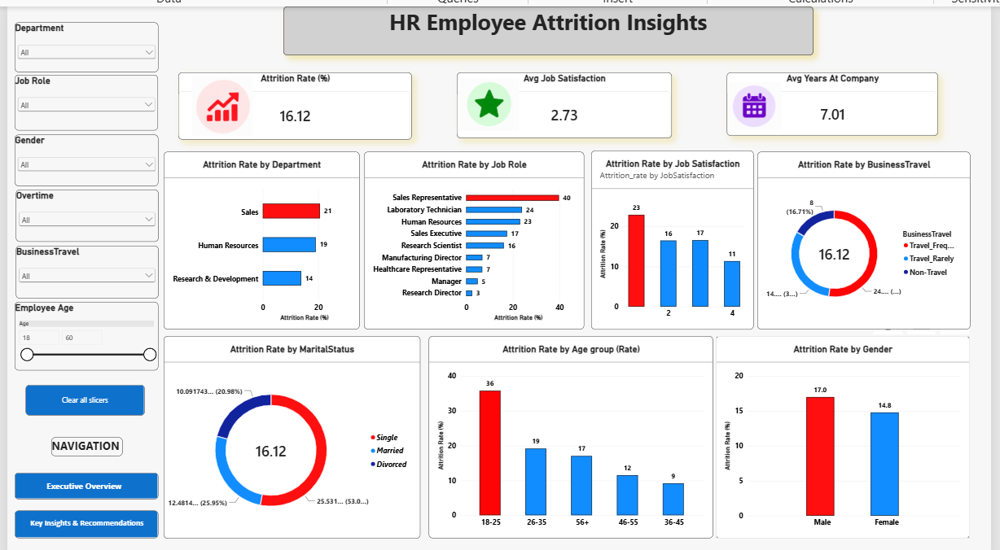

# HR Employee Attrition Analytics – Dashboard Screenshots

This folder contains screenshots of the Power BI dashboard created for the HR Employee Attrition Analytics project.

## 1. Executive Overview

Provides a high-level summary of employee attrition using key HR metrics and visualizations.

## 2. Attrition Insights

Provides detailed analysis of employee attrition across departments, job roles, age groups, gender, job satisfaction, business travel, and marital status.

## 3. Key Insights & Recommendations

Summarizes the major attrition insights, high-risk employee segments, and recommended business actions.

