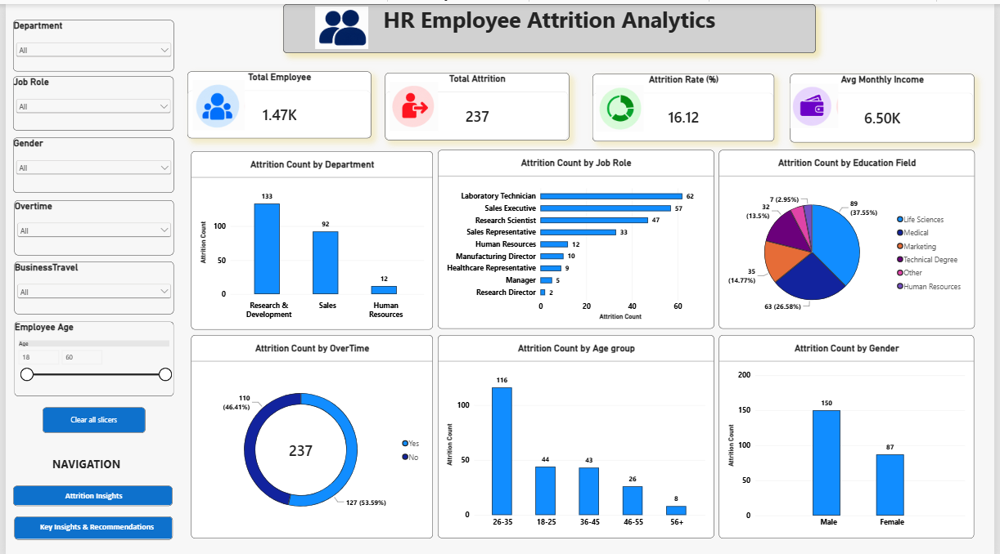
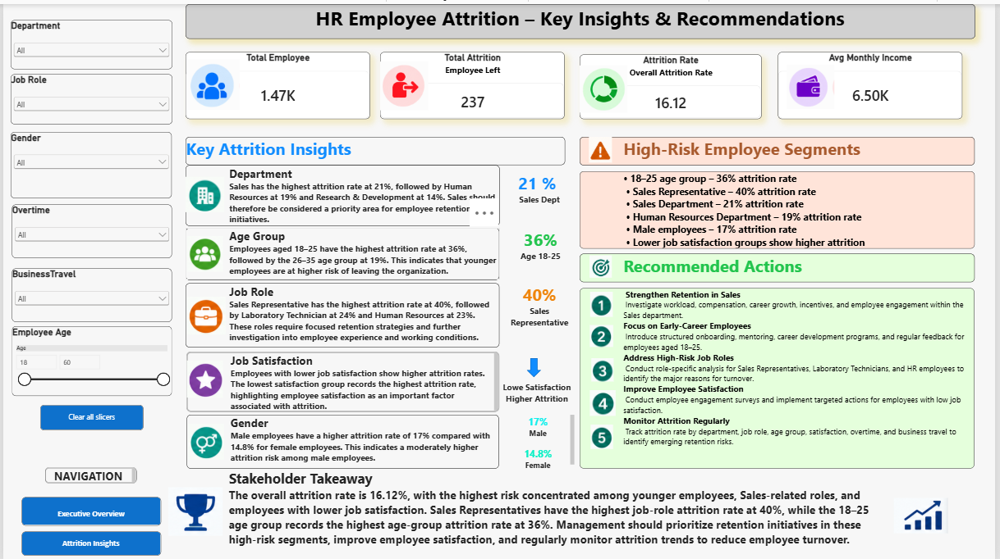

# HR Employee Attrition Analytics

## Project Overview
This project analyzes employee attrition patterns across a 1,470-employee HR dataset to
understand why employees leave and where the organization is most at risk of losing talent.
The workflow covers the full analytics pipeline: data cleaning in Python, business-question
analysis in SQL, and insight communication through an interactive Power BI dashboard.

## Business Problem
Employee attrition is costly — replacing an employee involves recruitment, onboarding, and
lost productivity. HR teams need to know *which* employee segments are leaving at the
highest rates and *why*, so retention efforts can be targeted rather than generic.

## Project Objectives
- Clean and validate a raw HR dataset for analysis
- Answer 25 HR-focused business questions using SQL
- Build an interactive Power BI dashboard summarizing attrition patterns
- Translate findings into practical, HR-relevant recommendations

## Dataset
- 1,470 employee records
- HR employee attrition dataset covering demographic, job, income, satisfaction, and
  work-related attributes (34 columns)
- Overall attrition rate: 16.12% (237 employees left)

## Tools & Technologies
- **Python** — Pandas, NumPy (data cleaning, preprocessing, exploratory analysis)
- **SQL (MySQL / MySQL Workbench)** — business question analysis
- **Power BI** — dashboard design and DAX measures
- **Git & GitHub** — version control and project hosting

## Project Workflow
Python (Data Cleaning) → SQL (Business Analysis) → Power BI (Dashboard) → Insights → Recommendations

## Python Data Cleaning
Using Pandas and NumPy, the raw dataset was cleaned and validated before analysis. This
included checking for and handling missing or inconsistent values, standardizing data types
and formats, and performing an initial exploratory pass to understand distributions and
relationships before moving into SQL-based analysis.

## SQL Analysis
25 HR analytics business questions were solved in MySQL, covering:
- Overall headcount and attrition counts/rates
- Attrition rate by department, job role, and combined department–job role ranking
- Attrition rate by age group, gender, and marital status
- Attrition rate by overtime status and business travel frequency
- Job satisfaction vs. attrition relationship
- Average income, age, and tenure comparison between employees who stayed vs. left
- Department contribution to total attrition (percentage share)
- Ranking job roles within each department by attrition rate (window functions)
- Department-wise attrition ranking using CTEs and RANK()/DENSE_RANK()
- Multi-factor risk segmentation (overtime + satisfaction + age group + job role combined)

SQL concepts used: SELECT, WHERE, GROUP BY, HAVING, ORDER BY, CASE WHEN, aggregate functions,
JOINs, subqueries, CTEs, and window functions (RANK, DENSE_RANK).

## Power BI Dashboard
A 3-page interactive dashboard was built with slicers for Department, Job Role, Gender,
Overtime, Business Travel, and Employee Age.

### 1. Executive Overview
High-level KPIs — Total Employees (1,470), Total Attrition (237), Attrition Rate (16.12%),
and Average Monthly Income — alongside attrition breakdowns by department, job role, and
education field.

### 2. Insights
Deeper attrition-rate breakdowns by department, job role, job satisfaction, business travel,
marital status, age group, and gender, alongside average job satisfaction and average tenure.

### 3. Recommendations
Key attrition insights summarized alongside high-risk employee segments and recommended
HR actions, closing with a one-line stakeholder takeaway.

## Key Insights
*(Findings directly supported by the analysis — not extrapolated beyond the dataset)*
- Sales has the highest departmental attrition rate (~20.6%), followed by Human Resources
  (~19.0%) and Research & Development (~13.8%)
- The 18–25 age group has the highest attrition rate (~36%) of any age segment
- Sales Representative is the job role with the highest attrition rate (~40%)
- Employees who worked overtime had a notably higher attrition rate (~30.5%) than those
  who did not (~10.4%)
- Employees with the lowest job satisfaction rating showed the highest attrition rate
  among satisfaction groups
- Male employees showed a slightly higher attrition rate (~17.0%) than female employees
  (~14.8%)
- Employees who left had, on average, lower income, were younger, and had shorter tenure
  than employees who stayed

## Key KPI
| Metric | Value |
|---|---|
| Total Employees | 1,470 |
| Attrition Count | 237 |
| Overall Attrition Rate | 16.12% |

## Business Recommendations
*(These are suggested actions based on the findings above — this is a portfolio/analytical
project and these recommendations were not implemented or tested in a live organization.)*
- **Strengthen retention in Sales:** review workload, compensation, and career growth paths
  for the Sales department specifically
- **Focus on early-career employees:** structured onboarding and mentoring for the 18–25
  age group, which shows the highest flight risk
- **Address overtime-driven burnout:** investigate workload distribution for employees
  regularly working overtime
- **Monitor job satisfaction proactively:** regular satisfaction surveys, since low
  satisfaction correlates strongly with attrition in this dataset
- **Track attrition by segment on an ongoing basis** rather than relying on a single
  overall attrition figure, since risk is concentrated rather than evenly spread

## Skills Demonstrated
Python, Pandas, NumPy, Data Cleaning, Data Preprocessing, SQL, MySQL, Joins, Subqueries,
CTEs, Window Functions, Aggregate Functions, Power BI, DAX, Data Modeling, Data Visualization,
Business Intelligence, HR Analytics, Exploratory Data Analysis, Business Insights,
Dashboard Design, KPI Reporting

   ## Dashboard Preview
   
   
   

## Conclusion
This project demonstrates a complete data analytics workflow — from raw, unstructured HR
data to a clean, decision-ready dashboard. It reflects practical SQL and Power BI ability
alongside the business judgment to translate analytical findings into recommendations an
HR stakeholder could realistically act on.

## Author
**Bapurao Patil**
Data Analyst 
Email: bapuraopatil.official@gmail.com
[LinkedIn: linkedin.com/in/bapuraopatil] | 
[GitHub: github.com/bapurao-data-analyst]
